# PLL_OSU180nm_VSD

## 1. Introduction to On-chip clock multiplier

 This repository focuses on design of On-Chip clock multiplier / PLL for VSD Open 2021 PLL Workshop.
 In this repository we are going to cover a brief description on PLL and also its pre-layout and post-layout simulations. 
 PLL is found in many wireless, radio, and general electronic items from mobile phones to broadcast radios, televisions to Wi-Fi routers, walkie talkie radios to professional   communications systems etc.
The On-chip clock multiplier is present in almost all synchronous processor chips (Integrated circuits).

## Table of Contents
- [1. Introduction to On-chip clock multiplier](#1-introduction-to-On-chip-clock-multiplier)
- [3. EDA Tools Used](#3-eda-tools-used)
- [4. Pre-layout Simulations](#4-Pre-layout-Simulations)
- [5. Post-layout and Simulations](#5-Post-Layout-Simulations)
- [6. Author](#6-Author)
- [7. Acknowledgments](#7-acknowledgments)
- [8. References](#8-References)

## 4. EDA Tools Used 
The design has been built using open-source EDA tools. The library used is osu180nm. 

1. [Ngspice](http://ngspice.sourceforge.net/download.html)
2. [Magic](http://opencircuitdesign.com/magic/)

## 5. Pre-layout Simulations
The complete circuit of PLL is built hierarchically using the following subcircuit blocks.

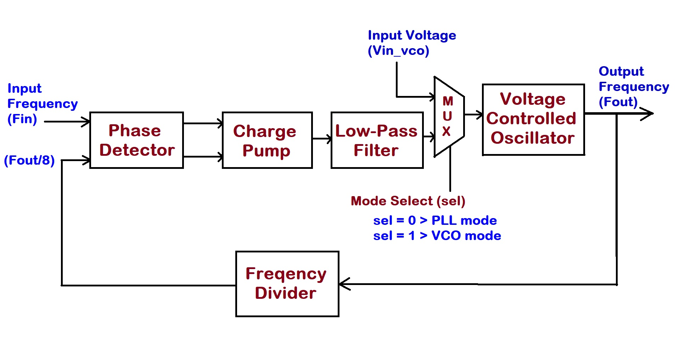

Fig: Block Diagrm of PLL Design.

**Pre-layout Simulation Results**

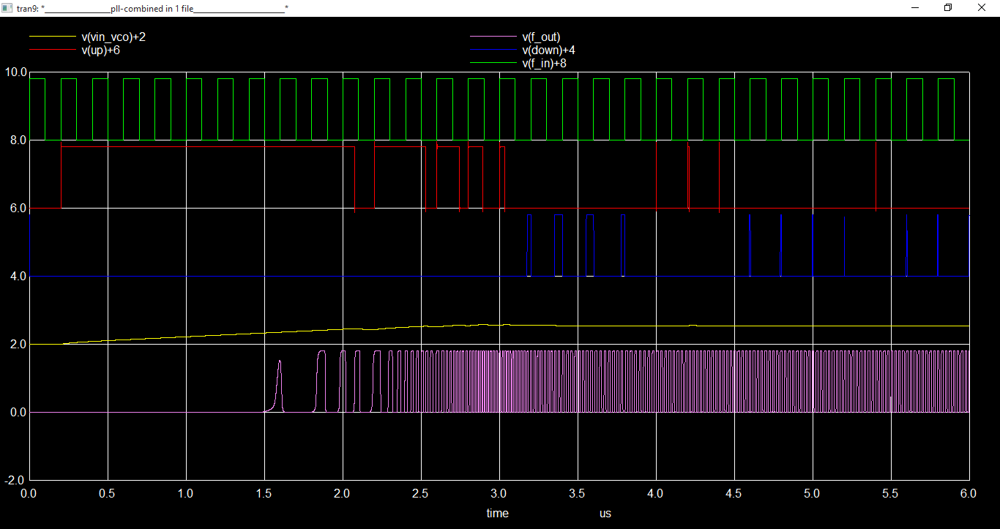

| Input Frequency | Output Frequency |
| :---:  | :-: |
|5MHz|39.73MHz|
|10MHz|80.91MHz|
|12MHz|96.1MHz|
|12.5MHz|99.81MHz|

## 6. Post-Layout Simulations 

### A. Phase Frequency Detector
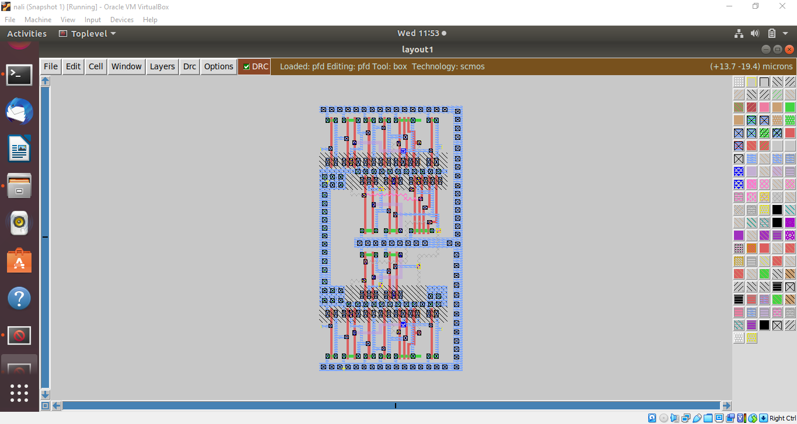

Fig: Layout of Phase Frequency Detector (PFD) or Phase Detector (PD)

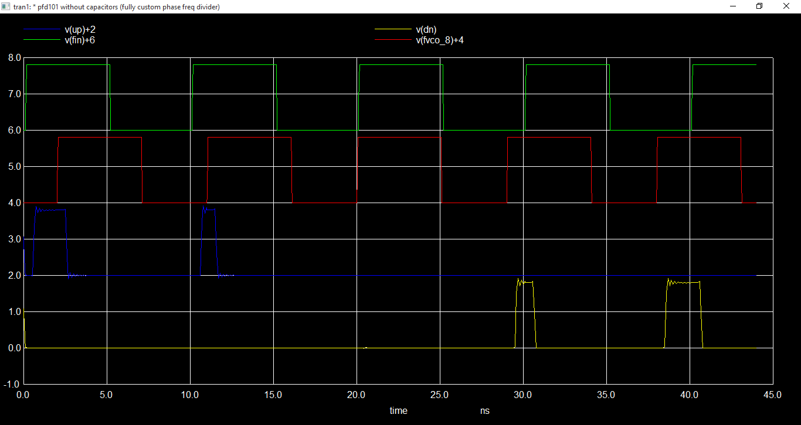

Fig: Input-Output waveforms of Phase Frequency Detector (PFD) or Phase Detector (PD) 

     Inputs - Fin (Input Frequency) &
              Fvco_8 (Output Frequency divide by 8) 
 

     Outputs - Up Signal &
               Down Signal         

### B. Voltage Controlled Oscillator
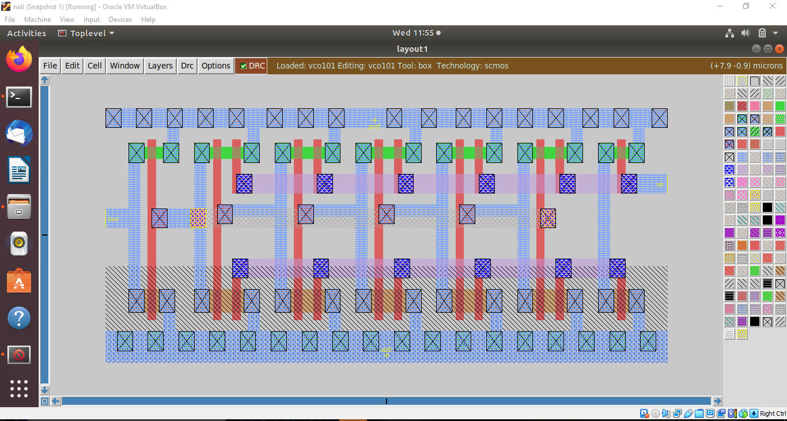

Fig: Layout of Voltage Controlled Oscillator (VCO).

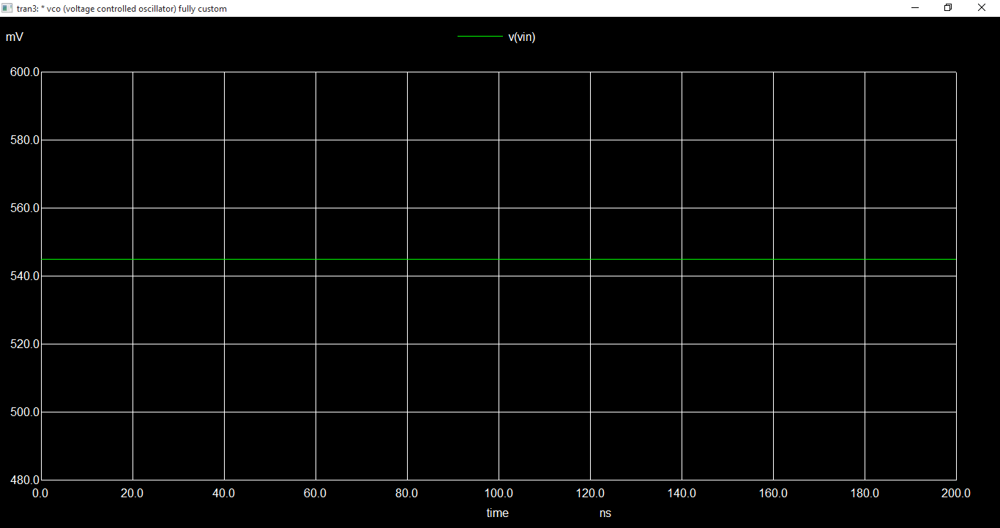
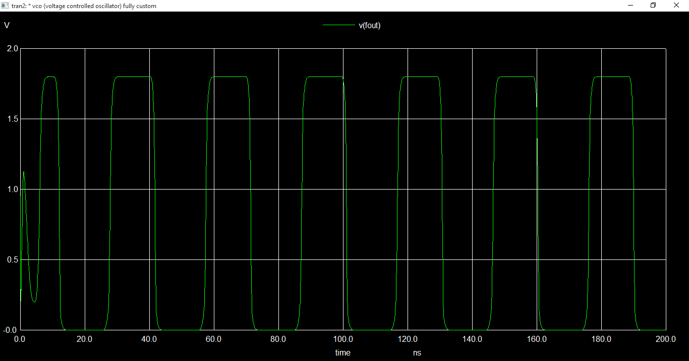

Fig: Input-Output waveforms of Voltage Controlled Oscillator (VCO). 

Vin - Input Voltage 

Fout - Output Frequency

### C. Frequency Divider by 2
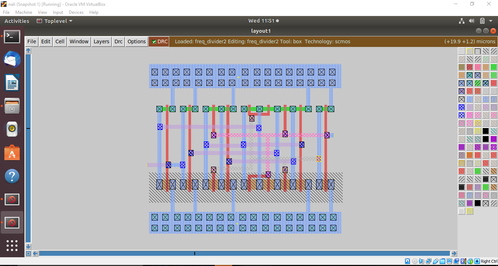

Fig: Layout of Frequency Divider by 2. 
 

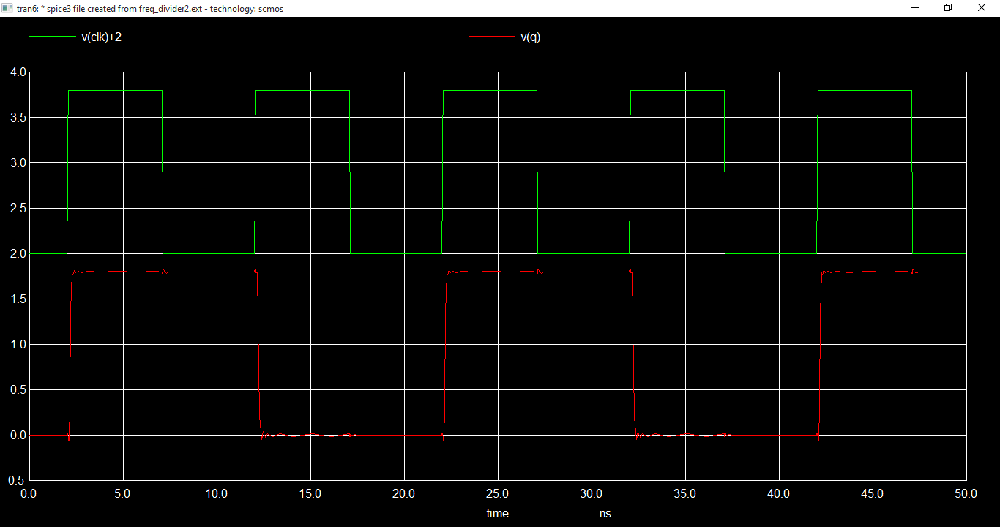

Fig: Input-Output waveforms of Frequency Divider by 2. 

clk - Input Freqency. 

q - Output Freqency (Input Freq. by 2). 

### D. Frequency Divider by 8
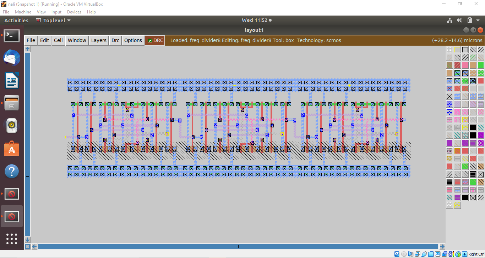

Fig: Layout of Frequency Divider by 8. 
 

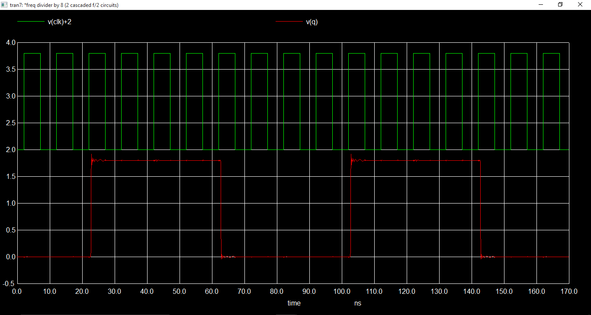

Fig: Input-Output waveforms of Frequency Divider by 8. 

clk - Input Freqency. 

q - Output Freqency (Input Freq. by 8). 

### E. 2:1 MUX
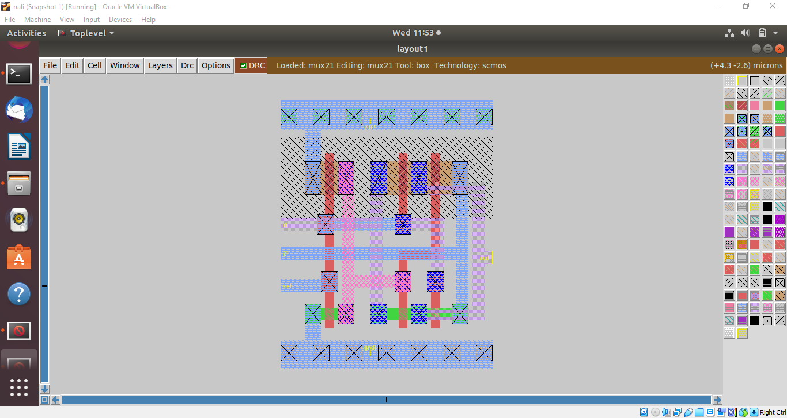

Fig: Layout of 2:1 MUX. 
 

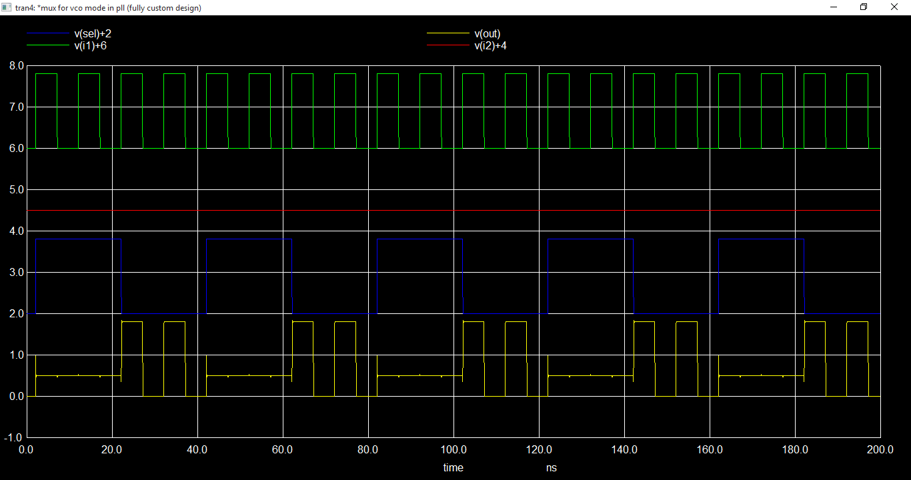

Fig: Input-Output waveforms of of 2:1 MUX. 
 
i1 - Input 1 
 
i2 - Input 2 
 
sel - Select 
 
out - Output 
 

### F. Phase lock Loop 

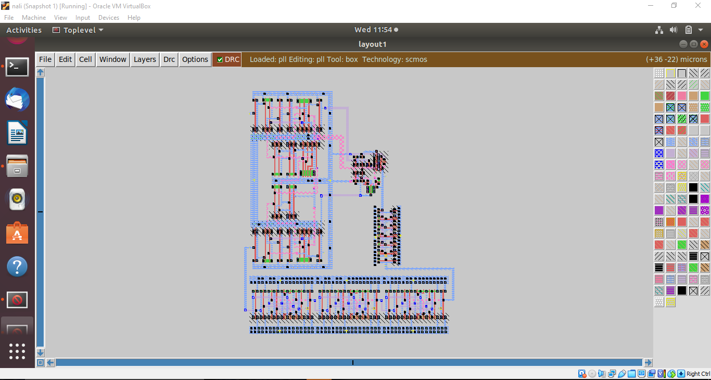

Fig: Layout of Phase Lock Loop (Combining all the Sub-circuits of PLL). 
 

#### a. Input frequency = 5MHz

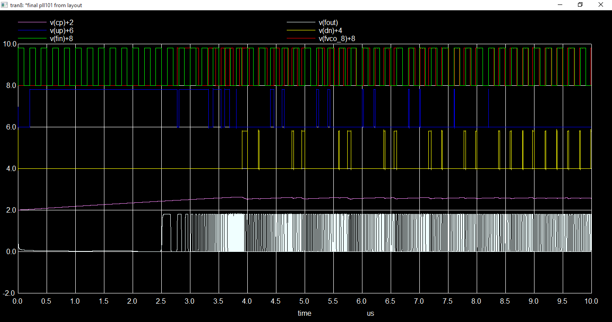

Fig: Input-Output waveforms of PLL. 
 
Fin - Input Frequency. 
 
Fvco_8 - Output Frequency divide by 8. 
 
up - Up signal 
 
down - Down signal 
 
Vcp - Input Voltaage of VCO  
 
fout - Output Frequency 
 

Note: As there were limitaions for for layout of capacitor in OSU180 tech file, I'm unable to make layout of Low Pass Filter.
However, using more mature & advanced nodes & PDK tech file, it can be made on silicon. 

## 7. Author

🖊️ Nalinkumar S , B.E (Electronics and Communication Engineering), Madras Institute of Technology, Anna University, Tamil Nadu 

## 8. Acknowledgments

 - Kunal Ghosh, Co-founder, VSD Corp. Pvt. Ltd. - kunalpghosh@gmail.com
 - Paras Gidd, M.Tech.( Microelectronics ), Manipal Institute of Technology,(MAHE), parasgidd@gmail.com

## 9. References

- https://github.com/parasgidd/avsdpll_3v3.git

