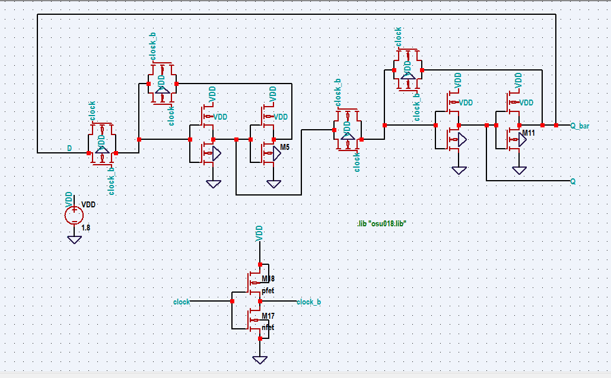

# PLL_OSU180nm_VSD

## Table of Contents
- [1. Introduction to On-chip clock multiplier](#1-introduction-to-On-chip-clock-multiplier)
- [2. EDA Tools Used](#2-eda-tools-used)
- [3. Pre-layout Simulations](#3-Pre-layout-Simulations)
- [4. Post-layout and Simulations](#4-Post-Layout-Simulations)
- [5. Author](#5-Author)
- [6. Acknowledgments](#6-acknowledgments)
- [7. References](#7-References)

## 1. Introduction to On-chip clock multiplier

 This repository focuses on design of On-Chip clock multiplier / PLL for VSD Open 2021 PLL Workshop.
 In this repository we are going to cover a brief description on PLL and also its pre-layout and post-layout simulations. 
 PLL is found in many wireless, radio, and general electronic items from mobile phones to broadcast radios, televisions to Wi-Fi routers, walkie talkie radios to professional   communications systems etc.
The On-chip clock multiplier is present in almost all synchronous processor chips (Integrated circuits).

Operation of feedback loop.

## 2. EDA Tools Used 
The design has been built using open-source EDA tools. The library used is osu180nm. 

🌟 Ngspice
 
   * Ngspice is a mixed-level/mixed-signal electronic circuit simulator.
   * Ngspice is based on three open-source free-software packages: 
      * Spice3f5
      * Xspice
      * Cider1b1
   
      🔗 http://ngspice.sourceforge.net/
      
 🌟 Magic
 
  * Magic is a venerable VLSI layout tool, written in the 1980's at Berkeley by John Ousterhout, now famous primarily for writing the scripting interpreter language Tcl. Due largely in part to its liberal Berkeley open-source license, magic has remained popular with universities and small companies.
  * The open-source license has allowed VLSI engineers with a bent toward programming to implement clever ideas and help magic stay abreast of fabrication technology. However, it is the well thought-out core algorithms which lend to magic the greatest part of its popularity.
  * Magic is widely cited as being the easiest tool to use for circuit layout, even for people who ultimately rely on commercial tools for their product design flow.
  
    🔗 http://opencircuitdesign.com/magic/

## 3. Pre-layout Simulations
The complete circuit of PLL is built hierarchically using the following subcircuit blocks.

Block Diagrm of PLL Design.

Schematic of PFD.

Schematic of Charge pump.

Schematic of VCO.

Schematic of Frequency Divider by 2.

Schematic of PLL.

**Pre-layout Simulation Results**

## 4. Post-Layout Simulations 

### A. Phase Frequency Detector

 Layout of Phase Frequency Detector (PFD) or Phase Detector (PD)

Input-Output waveforms of Phase Frequency Detector (PFD) or Phase Detector (PD) 

### B. Voltage Controlled Oscillator

Layout of Voltage Controlled Oscillator (VCO)

 Input-Output waveforms of Voltage Controlled Oscillator (VCO) 

### C. Frequency Divider by 2

 Layout of Frequency Divider by 2 
 

Input-Output waveforms of Frequency Divider by 2 

### D. Frequency Divider by 8

 Layout of Frequency Divider by 8 
 

 Input-Output waveforms of Frequency Divider by 8 

### E. 2:1 MUX

 Layout of 2:1 MUX 
 

Input-Output waveforms of of 2:1 MUX 
 

### F. Phase lock Loop 

Layout of Phase Lock Loop 
 

#### a. Input frequency = 5MHz

Input-Output waveforms of PLL. 
 

## 5. Author

🖊️  Nalinkumar S , B.E (Electronics and Communication Engineering), Madras Institute of Technology, Anna University, Tamil Nadu 

## 6. Acknowledgments

 - Kunal Ghosh, Co-founder, VSD Corp. Pvt. Ltd. - kunalpghosh@gmail.com
 - Paras Gidd, M.Tech.( Microelectronics ), Manipal Institute of Technology,(MAHE), parasgidd@gmail.com

## 7. References

- https://github.com/parasgidd/avsdpll_3v3.git

